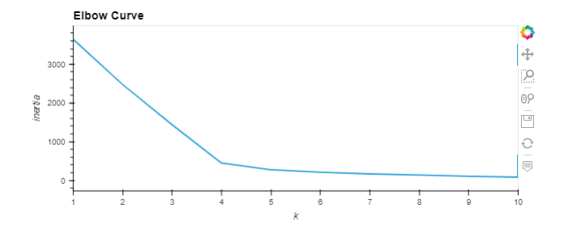
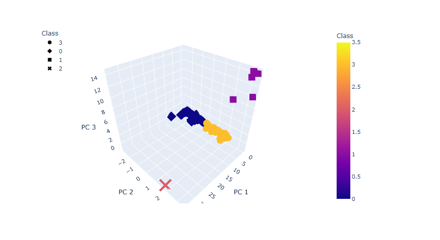
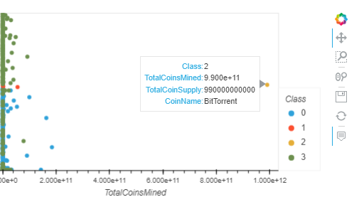

# Cryptocurrencies

## Overview
The aim of this project is to employ unsupervised machine learning to scrutinize a cryptocurrency database and 
devise a comprehensive report. The report will categorize the traded cryptocurrencies based on their distinctive attributes. 
An investment bank may utilize this report to suggest a fresh cryptocurrency investment portfolio to their clients.

## Resources:
### Software: 
* Python
* Jupyter Notebook

### Data source
* [crypto_data.csv](https://github.com/anrobertson/Cryptocurrencies/blob/main/crypto_data.csv)

## Results:

### Elbow Curve
 
By utilizing the K-Means method, we generated the elbow curve presented below, which involved iterating through k values from 1 to 10.
After evaluating the elbow curve, we determined that the optimal value for k is 4, leading us to conclude that 4 clusters are ideal for categorizing the cryptocurrencies.

### 3D Scatter Plot with Clusters
 
The three-dimensional scatter plot presented below was obtained through the utilization of the Principal Component Analysis (PCA) algorithm. 
The purpose of utilizing PCA was to reduce the dimensions of the cryptocurrencies down to their three most important principal components, which could 
be accurately visualized in the 3D plot. By doing so, we were able to discern patterns and relationships between the cryptocurrencies that would have been 
challenging to identify with a higher number of dimensions.

### 2D Scatter Plot
 
The two-dimensional scatter plot depicted below was obtained using the Principal Component Analysis (PCA) algorithm, which was utilized to reduce the dimensions 
of the cryptocurrencies down to their two most significant principal components. By using this approach, we were able to visualize the relationships and patterns 
between the cryptocurrencies more effectively. The PCA algorithm helps to eliminate unnecessary information while retaining the most important features, which enabled 
us to create a more precise and insightful representation of the data. The reduced dimensionality also made it easier to identify clusters and patterns that might 
not have been readily apparent with a higher number of dimensions. Overall, the 2D scatter plot obtained through the PCA algorithm serves as an excellent tool 
for further analysis and interpretation of the cryptocurrency dataset.

## Summary 
After completing the preprocessing and cleaning phase, we are left with a total of 532 cryptocurrencies that are deemed tradable. 
Through our analysis, we have successfully classified 532 cryptocurrencies into distinct groups based on the similarities of their features. 
However, our work is not yet complete. In order to provide valuable insights to the investment bank's clients, we must conduct a thorough analysis of 
each group's particularities. This analysis will help us to determine the performance of each group and assess their potential interest to the investment 
bank's clients. By doing so, we will be able to provide our clients with informed recommendations on the best investment opportunities within the 
cryptocurrency market. Our analysis will also help us to identify any potential risks or drawbacks associated with each group, enabling us to provide 
a well-rounded and comprehensive overview of the cryptocurrency landscape.
